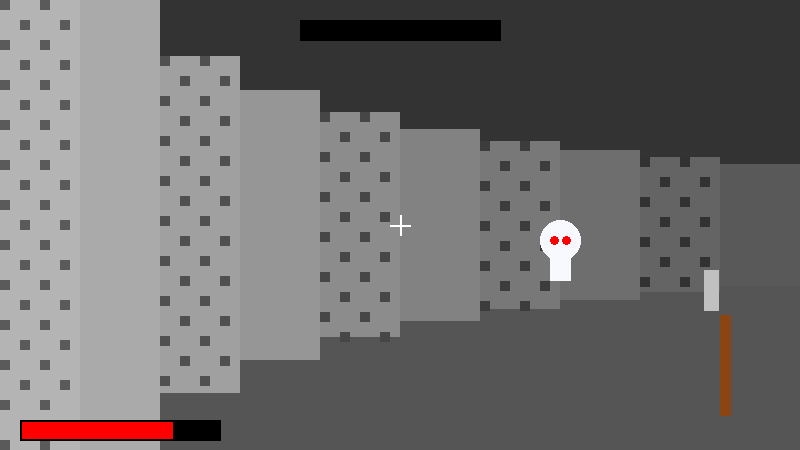

# Dungeon Adventure Game

A first-person dungeon adventure game that runs entirely in the browser using JavaScript and Canvas2D with raycasting-based rendering. The game features textured walls, environmental interactions (doors, chests, levers), and basic combat.



## Features

- **Raycasting Engine**: 3D rendering of a 2D grid-based map
- **Texture Mapping**: Detailed wall textures and sprite rendering
- **Environmental Interactions**: Doors, chests, levers, and more
- **Combat System**: Fight enemies with different weapons
- **Inventory System**: Collect and use items
- **Save/Load**: Game progress saved to localStorage
- **Fully Client-Side**: No server dependencies, perfect for static hosting

## Technical Documentation

This section provides detailed documentation of all objects, functions, and models in the game.

### Core Classes

#### RaycastingEngine

The `RaycastingEngine` class handles 3D rendering of a 2D grid-based map using raycasting techniques.

**Constructor**
```javascript
constructor(canvas, fov = 75)
```
- `canvas`: The HTML canvas element to render to
- `fov`: Field of view in degrees (default: 75)

**Properties**
- `canvas`: The HTML canvas element
- `ctx`: The 2D rendering context
- `fov`: Field of view in radians
- `textures`: Object containing loaded texture images
- `sprites`: Object containing loaded sprite images
- `textureData`: Cache for processed texture data
- `map`: Current map data
- `player`: Player object with position, angle, and movement properties
- `CELL_SIZE`: Size of each cell in the grid (1)
- `WALL_HEIGHT`: Height of walls (1)
- `MAX_DISTANCE`: Maximum rendering distance (20)
- `offscreenCanvas`: Canvas used for texture processing
- `offscreenCtx`: Context for the offscreen canvas
- `halfHeight`: Half the height of the canvas
- `numRays`: Number of rays to cast (equal to canvas width)
- `rayAngleStep`: Angle between each ray
- `depthTextureConfig`: Configuration for depth textures
- `wallSectionsWithDepth`: Array of wall sections with depth textures

**Methods**

*Core Rendering*
- `resize()`: Resize the canvas to match the window size
- `render()`: Render the scene
- `castRay(angle)`: Cast a single ray and calculate the distance to the nearest wall
- `drawTexturedWallSlice(x, drawStart, lineHeight, brightness, side, textureName, textureX)`: Draw a textured wall slice
- `drawFallbackWallSlice(x, drawStart, lineHeight, brightness, side)`: Draw a fallback wall slice with solid color
- `renderSprites(zBuffer, sprites)`: Render sprites (enemies, items, etc.)
- `renderPlayerHand()`: Render the player's hand and weapon
- `renderDebugMap()`: Render a debug map overlay in the corner of the screen
- `visualizeRay(angle, rayResult)`: Visualize a ray on the debug map

*Asset Management*
- `loadTexture(name, url)`: Load a texture from a URL
- `processTextureData(name, img)`: Process texture data for faster rendering
- `createFallbackTextureData(name)`: Create fallback texture data
- `loadSprite(name, url)`: Load a sprite from a URL

*Map Interaction*
- `setMap(map)`: Set the current map
- `initializeDepthTextures()`: Initialize depth textures for walls
- `isWall(x, y)`: Check if a position is inside a wall
- `getWallTexture(x, y)`: Get the texture for a wall at the given position
- `isSecretWall(mapX, mapY)`: Check if a wall is a secret wall

*Debug Utilities*
- `createRedTintedTexture(sourceTextureName, targetTextureName)`: Create a red-tinted version of an existing texture
- `createRedTexture()`: Create a red texture for debug mode

#### DungeonGame

The `DungeonGame` class handles the main game logic, including input, game state, and mechanics.

**Constructor**
```javascript
constructor()
```

**Properties**
- `canvas`: The HTML canvas element
- `engine`: Instance of RaycastingEngine
- `audio`: Instance of AudioManager
- `state`: Game state object containing health, inventory, enemies, etc.
- `keys`: Object tracking keyboard input
- `mouse`: Object tracking mouse position and lock state
- `debug`: Debug state object
- `healthBar`: Health bar UI element
- `inventoryElement`: Inventory UI element
- `inventorySlotsElement`: Inventory slots UI element
- `loadingScreen`: Loading screen UI element
- `progressBar`: Progress bar UI element
- `debugIndicator`: Debug indicator UI element
- `minimapCanvas`: Canvas for the minimap

**Methods**

*Initialization and Game Loop*
- `init()`: Initialize the game
- `createMinimapCanvas()`: Create minimap canvas
- `gameLoop(timestamp)`: Game loop
- `loadConfig()`: Load game configuration from config.json
- `loadAssets()`: Load game assets
- `loadLevel(levelNumber)`: Load a level
- `createFallbackLevel()`: Create a fallback level if level loading fails

*Player and Enemy Management*
- `handleInput(deltaTime)`: Handle player input
- `initializeEnemies(levelData)`: Initialize enemies from level data
- `updateEnemies(deltaTime)`: Update enemies
- `getEnemyHealth(type)`: Get enemy health based on type
- `getEnemyDamage(type)`: Get enemy damage based on type
- `getEnemySpeed(type)`: Get enemy speed based on type
- `getEnemyTexture(type)`: Get enemy texture based on type

*UI and Rendering*
- `updateExploredMap()`: Update explored map based on player position
- `renderMinimap()`: Render the minimap
- `renderDebugInfo()`: Render debug information
- `updateHealthBar()`: Update health bar UI
- `showInGameMessage(message, duration)`: Display an in-game message to the player
- `showError(message)`: Display an error message to the user

*Game Mechanics*
- `interact()`: Interact with objects in front of the player
- `attack()`: Attack with the current weapon
- `getWeaponData(weaponName)`: Get weapon data
- `playSound(soundName)`: Play a sound
- `toggleInventory()`: Toggle inventory visibility
- `updateInventoryUI()`: Update inventory UI
- `useItem(index)`: Use or equip an item
- `getItemDisplayName(itemId)`: Get display name for an item
- `addItemToInventory(itemId)`: Add an item to the player's inventory
- `checkLevelCompletion(door)`: Check if the player has completed the level
- `gameOver()`: Game over handler

*Save/Load*
- `saveGame()`: Save game state to localStorage
- `loadGame()`: Load game state from localStorage

*Event Handling*
- `bindEvents()`: Bind event handlers

#### AudioManager

The `AudioManager` class handles loading, playing, and managing audio assets.

**Constructor**
```javascript
constructor()
```

**Properties**
- `audioContext`: Web Audio API context
- `sounds`: Object containing loaded sound effects
- `music`: Object containing loaded music tracks
- `currentMusic`: Currently playing music track
- `settings`: Audio settings (volumes, mute state)
- `atmosphericSounds`: Array of atmospheric sound names
- `atmosphericTimer`: Timer for playing random atmospheric sounds
- `masterGain`: Master gain node
- `musicGain`: Music gain node
- `sfxGain`: Sound effects gain node

**Methods**

*Initialization*
- `initAudioContext()`: Initialize the audio context
- `resumeAudioContext()`: Resume audio context (needed for browsers that suspend it until user interaction)

*Asset Loading*
- `loadSound(name, url)`: Load a sound effect
- `loadMusic(name, url)`: Load background music

*Playback Control*
- `playSound(name, volume)`: Play a sound effect
- `playMusic(name, fadeIn, fadeTime)`: Play background music
- `stopMusic(fadeOut, fadeTime)`: Stop background music
- `pauseAll()`: Pause all audio
- `resumeAll()`: Resume all audio

*Volume Control*
- `setMasterVolume(volume)`: Set master volume
- `setMusicVolume(volume)`: Set music volume
- `setSfxVolume(volume)`: Set sound effects volume
- `toggleMute()`: Toggle mute
- `setMuted(muted)`: Set mute state

*Atmospheric Sounds*
- `startAtmosphericSoundsTimer()`: Start the atmospheric sounds timer
- `stopAtmosphericSoundsTimer()`: Stop the atmospheric sounds timer
- `playRandomAtmosphericSound()`: Play a random atmospheric sound at a lower volume

### Game Objects

#### Player

The player object is stored in the `engine.player` property.

**Properties**
- `x`: X coordinate in the map
- `y`: Y coordinate in the map
- `angle`: Viewing angle in radians
- `speed`: Movement speed
- `rotationSpeed`: Rotation speed

#### Enemy

Enemies are stored in the `state.enemies` array.

**Properties**
- `type`: Enemy type (skeleton, goblin, wizard, boss)
- `x`: X coordinate in the map
- `y`: Y coordinate in the map
- `health`: Current health
- `damage`: Damage dealt to player
- `speed`: Movement speed
- `state`: Current state (idle, attacking)
- `lastAttack`: Timestamp of last attack
- `lastGrowl`: Timestamp of last growl
- `texture`: Texture name for the enemy

#### Map

Maps are loaded from JSON files in the `assets/maps` directory.

**Properties**
- `width`: Width of the map in cells
- `height`: Height of the map in cells
- `layout`: 2D array of cells representing the map layout
- `objects`: Object containing definitions for special objects in the map
- `playerStart`: Starting position for the player

**Cell Types**
- `W`: Wall
- `.`: Empty space
- `D`: Door
- `S`: Skeleton enemy
- `G`: Goblin enemy
- `W`: Wizard enemy
- `B`: Boss enemy
- `C`: Chest
- `P`: Potion

#### Item

Items are stored in the player's inventory.

**Types**
- `weapon`: Weapons that can be equipped
- `potion`: Consumable items that restore health
- `key`: Keys used to unlock doors

**Weapon Properties**
- `type`: "weapon"
- `damage`: Damage dealt to enemies
- `range`: Attack range
- `name`: Display name

**Potion Properties**
- `type`: "potion"
- `effect`: Effect type (health)
- `value`: Amount of health restored
- `name`: Display name

**Key Properties**
- `type`: "key"
- `keyType`: Key type (gold, silver)
- `name`: Display name

### Game Configuration

The game configuration is stored in `config.json`.

**Properties**
- `game`: Basic game information (title, version)
- `display`: Display settings (width, height, fullscreen, fov)
- `audio`: Audio settings (volumes, ambient sounds)
- `controls`: Control settings (sensitivity, key bindings)
- `gameplay`: Gameplay settings (difficulty, enemy density, loot density)
- `depthTextures`: Depth texture settings (enabled, density, distances)
- `debug`: Debug settings (enabled, show map objects)

## Getting Started

### Prerequisites

- A modern web browser (Chrome, Firefox, Safari, Edge)
- Basic knowledge of HTML, CSS, and JavaScript (for development)

### Setup

1. Clone or download this repository
2. Run the setup script to create the necessary directories:
   - On Windows: Double-click `setup_directories.bat` or run `npm run setup`
3. Generate the game assets using one of these methods:
   
   **Option A: Python Asset Generator (Recommended)**
   - Make sure you have Python 3.6+ installed
   - Double-click `generate_assets.bat` to run the asset generator
   - All assets will be automatically created and saved to the correct directories
   
   **Option B: Browser-based Asset Generator**
   - Open `generate_textures.html` in your browser
   - Click the "Generate All Textures" button
   - Save each texture to its appropriate directory as prompted
   
4. Open `index.html` in your browser to play the game

### Development Setup

If you want to modify the game:

1. Install Node.js if you want to use the provided npm scripts
2. Run `npm install` to install development dependencies
3. Use `npm start` to run a local development server
4. Make changes to the JavaScript files (`engine.js`, `game.js`)
5. Refresh the browser to see your changes
6. No build step is required as this is pure JavaScript

## Game Controls

- **W, A, S, D**: Move forward/backward, strafe left/right
- **Mouse or Arrow Keys**: Turn left/right
- **E**: Interact with objects (open doors, chests, press switches)
- **Space**: Attack
- **I**: Open/close inventory

## Level Creation

Levels are defined in JSON files located in the `assets/maps` directory. Each level file follows this format:

```json
{
  "width": 15,
  "height": 15,
  "layout": [
    ["W", "W", "W", "W", "W"],
    ["W", ".", ".", ".", "W"],
    ["W", ".", "W", ".", "W"],
    ["W", ".", ".", ".", "W"],
    ["W", "W", "W", "W", "W"]
  ],
  "objects": {
    "D": {"type": "door", "locked": true, "keyType": "gold"},
    "S": {"type": "enemy", "enemyType": "skeleton"},
    "C": {"type": "chest", "contains": "key_gold"}
  },
  "playerStart": {"x": 1, "y": 1}
}
```

Where:
- `W` represents walls
- `.` represents empty space
- Other letters represent objects defined in the `objects` section

## Deployment on Amazon S3

### Automated Deployment

The project includes a deployment script that automates the process:

```
node deploy-to-s3.js your-bucket-name [region]
```

Or using npm:

```
npm run deploy your-bucket-name [region]
```

This script will:
1. Create an S3 bucket if it doesn't exist
2. Configure it for static website hosting
3. Set appropriate permissions
4. Upload all game files
5. Provide you with the URL to access your game

### Manual S3 Bucket Setup

If you prefer to set up the S3 bucket manually:

1. **Create an S3 bucket**:
   - Sign in to the AWS Management Console
   - Navigate to the S3 service
   - Click "Create bucket"
   - Enter a unique bucket name (e.g., `dungeon-game`)
   - Choose a region close to your target audience
   - Keep default settings and click "Create bucket"

2. **Enable Static Website Hosting**:
   - Select your new bucket
   - Go to the "Properties" tab
   - Scroll down to "Static website hosting"
   - Click "Edit"
   - Select "Enable"
   - Enter `index.html` for both Index and Error document
   - Click "Save changes"

3. **Set Bucket Permissions**:
   - Go to the "Permissions" tab
   - Uncheck "Block all public access" (since this is a public website)
   - Click "Save"
   - Confirm by typing "confirm"
   - Add a Bucket Policy to make all objects public:
     - Click "Bucket Policy"
     - Paste the following policy (replace `your-bucket-name` with your actual bucket name):

```json
{
  "Version": "2012-10-17",
  "Statement": [
    {
      "Sid": "PublicReadGetObject",
      "Effect": "Allow",
      "Principal": "*",
      "Action": "s3:GetObject",
      "Resource": "arn:aws:s3:::your-bucket-name/*"
    }
  ]
}
```

4. **Upload the Game Files**:
   - Go to the "Objects" tab
   - Click "Upload"
   - Add all files and folders from your project
   - Click "Upload"

   Alternatively, use the AWS CLI:
   ```sh
   aws s3 sync ./dungeon-crawler s3://your-bucket-name --acl public-read
   ```

5. **Access Your Game**:
   - Go to the "Properties" tab
   - Scroll down to "Static website hosting"
   - Find your website endpoint URL (e.g., `http://your-bucket-name.s3-website-us-east-1.amazonaws.com`)
   - Open this URL in your browser to play the game

### Optional: Set Up CloudFront for Better Performance

1. Create a CloudFront distribution pointing to your S3 bucket
2. Use the CloudFront URL for faster global access to your game

## Project Structure

```
/dungeon-crawler/
├── index.html              # Main HTML entry point
├── game.js                 # Core game logic
├── engine.js               # Raycasting engine
├── styles.css              # Game styling
├── assets/                 # Assets directory
│   ├── textures/           # Wall & floor textures
│   ├── sprites/            # Enemies, items, projectiles
│   │   ├── enemies/        # Enemy sprites
│   │   ├── items/          # Item sprites
│   │   └── player/         # Player sprites
│   ├── audio/              # Game sound effects and music
│   │   ├── music/          # Background music
│   │   └── sfx/            # Sound effects
│   ├── maps/               # Level definitions in JSON
│   └── ui/                 # UI Elements
├── generate_assets.py      # Python script to generate all assets
├── generate_assets.bat     # Batch file to run the Python asset generator
├── setup_directories.bat   # Creates the directory structure
├── generate_textures.html  # Browser-based tool to generate textures
├── generate_textures.js    # JavaScript texture generation script
├── generate_screenshot.html # Tool to generate game screenshot
├── config.json             # Game configuration
├── package.json            # Project configuration
├── deploy-to-s3.js         # S3 deployment script
├── README.md               # Project documentation
└── LICENSE                 # MIT License
```

## Browser Compatibility

The game uses standard HTML5 Canvas API and JavaScript features supported by all modern browsers. For best performance, use the latest version of Chrome, Firefox, Safari, or Edge.

## License

This project is licensed under the MIT License - see the LICENSE file for details.

## Acknowledgments

- Inspired by classic games like Wolfenstein 3D
- Built with pure JavaScript and HTML5 Canvas
- Special thanks to the raycasting community for their tutorials and resources
